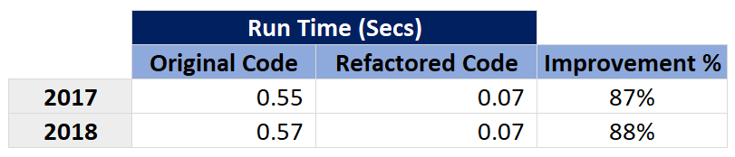
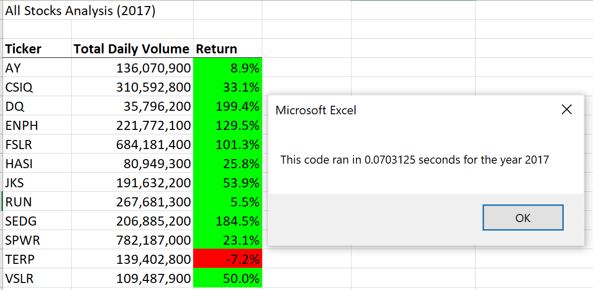
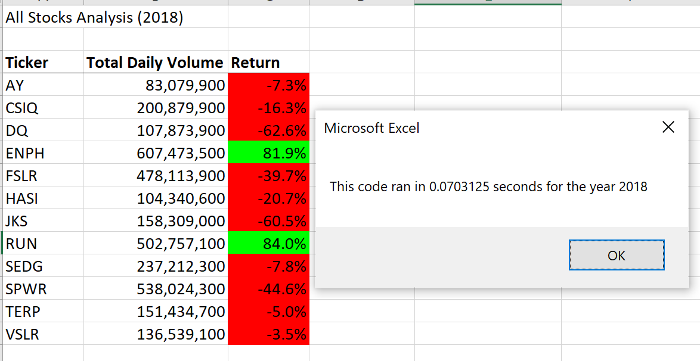

# Stock Analysis

## Overview of Project

### Background

    Steve is exploring options to diversify his parent's stock portfolio by analysing the performance 
    of green energy stocks in 2017 and 2018

    To build the anlaysis of Green Energy stocks to help steve and his parents to invest their money.
     
### Purpose

     Purpose of the project is to automate analysis of green energy stock performance using excel VB scipt 
     and also to optimize/refactor the code to execute faster.
     
     Use two years of data and analyze Total Daily Volume and Yearly Return. Use VBA to write a script 
     to analyze the data in simpliest way with a single click.

     Review original code and refactor the code to make it efficent and fast.

## Results

    Compiled the results in two sections 
    1. Stock performance analysis
    2. Execution Times between original and refactor code

### Stock performances

    Based on history data for two years (2017 & 2018),

    - Only two stocks provided good returns in both years (ENPH and RUN) and the same reflects in the 
    volume growth of these two stock tradings

    - 10 out of 12 stocks underperformed in 2018

### Execution Times
    
    Refactored code runs with an improvement of **87%** in execution time compared to original code. 
    Run time improved from 0.55 secs to 0.07 secs.
   
     

    Refactored code's Run time for 2017 
     

    Refactored code's Run time for 2018 
     

## Summary

### Pros and Cons of Refactoring Code

    In general, refactoring code will help to improve and enhance the original code.
    
#### Pros

    - Better performance: 
                In terms of functionality and faster execution times
    - Standardize code: 
                Create reusable code blocks and maintain standard code across apps/programs
    - Improve code readability: 
                Makes it easier to maintain the code
    - Continuous code improvement: 
                Take advantage of new techniques, design ideas and simplify code

#### Cons

    - New Bugs/Errors
                Modifying the code might introduce new errors as the base code is changing
    - Change in functionality
                Along with improving functionality, there is a chance of missing existing functionality or different user experience
    - Testing efforts
                Require full testing to ensure success of code refactoring

### Pros/Cons of Original Code vs Refactored Code

#### Original Code

##### Pros

    - Simple coding structure: 
                Easy to read through for entry level skills
    - Core functionality works as expected: 
                Able to analyse stocks by running the original code

##### Cons

    - Longer run time
    - Loop through more rows than needed
    - No use of arrays

#### Refactored VBA Code

##### Pros

    - Faster run time
    - Use of better coding technique
        Use of arrays instead of single variable 
    - Efficient data processing
    - Improved code comments

##### Cons

    - Hardcoded ticker values
            Prone to break if data set changes to add/remove tickers
            Can be dynamically built using source data
    - Activation of sheets in the for loop
            Can be done before the loop to avoid duplication of activating sheet for every loop
